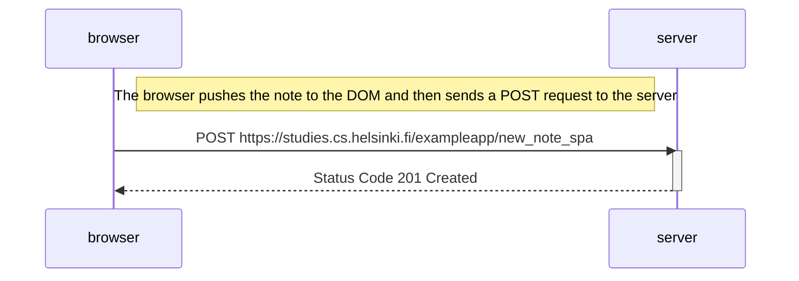

```mermaid
sequenceDiagram
    participant browser
    participant server

    Note right of browser: The browser pushes the note to the DOM and then sends a POST request to the server

    browser->>server: POST https://studies.cs.helsinki.fi/exampleapp/new_note_spa

    activate server
    server-->>browser: Status Code 201 Created
    deactivate server
```